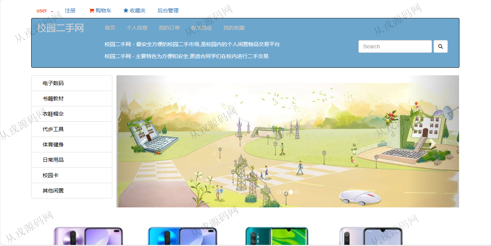
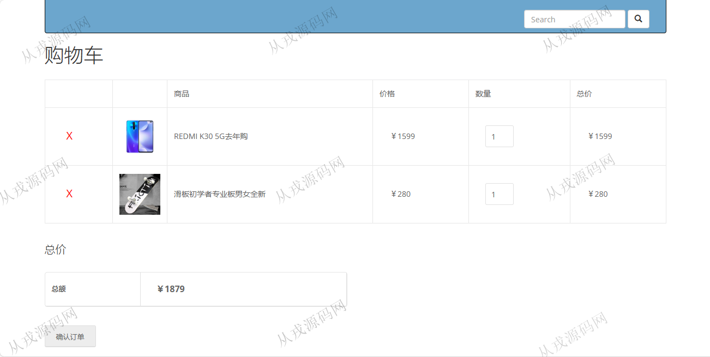
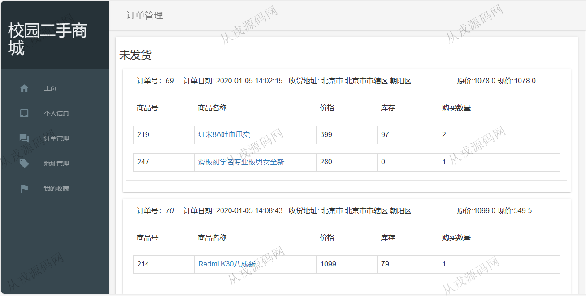
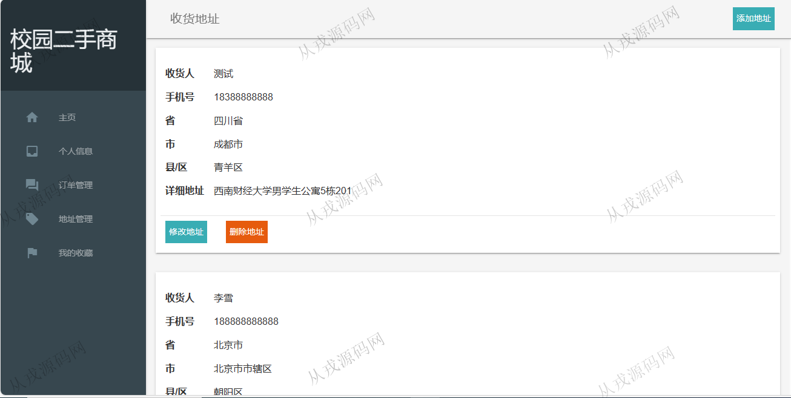
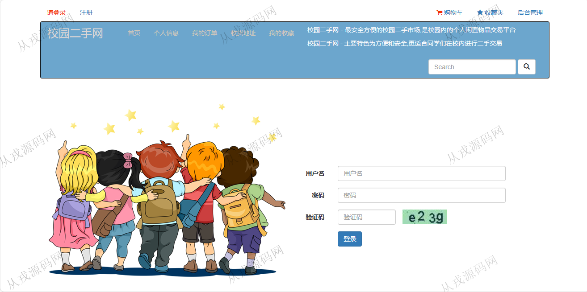
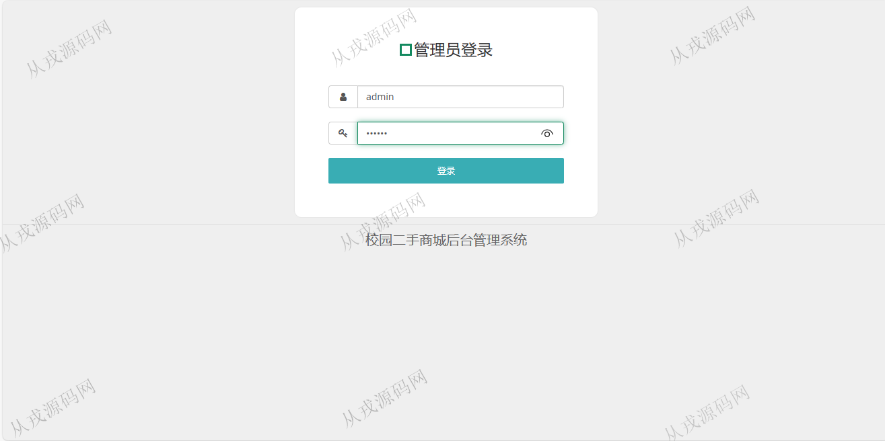
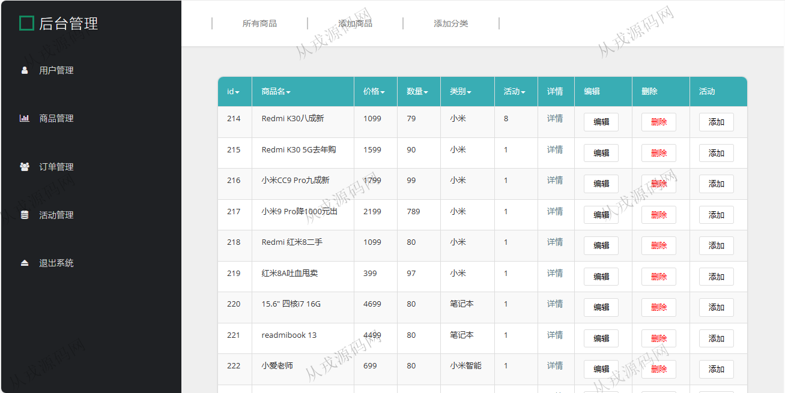

<h1 align="center">142.校园二手网管理系统</h1>

- <b>完整代码获取地址：从戎源码网 ([https://armycodes.com/](https://armycodes.com/))</b>
- <b>技术探讨、资料分享，请加QQ群：692619798</b> 
- <b>作者微信：19941326836  QQ：952045282</b> 
- <b>承接计算机毕业设计、Java毕业设计、Python毕业设计、深度学习、机器学习</b>
- <b>选题+开题报告+任务书+程序定制+安装调试+论文+答辩ppt 一条龙服务</b>
- <b>所有选题地址 ([https://github.com/YuLin-Coder/AllProjectCatalog](https://github.com/YuLin-Coder/AllProjectCatalog)) </b>

## 项目介绍
基于springboot的校园二手网管理系统：前端 jsp、jquery，后端 maven、springmvc、spring、mybatis；角色分为管理员、用户；集成校园二手商品展示、商品详情、购物车，在线结算等功能于一体的系统。

## 功能介绍

### 用户

- 基本功能：登录，注册，退出，个人信息查看与修改，密码修改
- 网站首页：主导航栏，轮播图，分类导航商品，商品展示，全局搜索
- 商品购买：商品列表展示，商品详情，收藏，购物车，在线结算
- 我的订单：本人订单信息查询，订单评价，订单删除
- 地址管理：收货地址信息的增删改查
- 我的收藏：收藏列表查看与商品取消收藏

### 管理员

- 用户管理：用户信息由前台用户自行注册而来，管理员可以查看用户信息和删除用户
- 商品管理：分类信息的增删改查，商品信息的增删改查，商品图片上传，给商品添加促销活动
- 订单管理：用户在前台购买商品的订单数据，管理员查看，发货
- 活动管理：活动信息的列表查询，活动添加，活动删除

## 环境

- <b>IntelliJ IDEA 2021.3</b>

- <b>Mysql 5.7.26</b>

- <b>JDK 1.8</b>

## 运行截图

